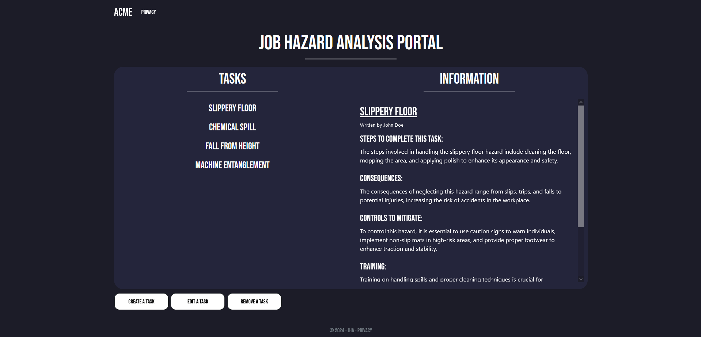

<h3 align="center">Benjamin Trang 2024 Innovative Coding Challenge</h3>

  

    This is a readme to help the people evaluting my technical submission get started.
     

<!-- ABOUT THE PROJECT -->
## About The Project

Hello, hope you are doing well today! This is my submission for the technical challenge presented to me from Innovative Refrigeration Systems.
I was given four days to complete this assessment and it was a fun and challenging scenario to complete. This web application was written in C# in ASP.NET Core
using CSS libraries Bootstrap and jQuery.

 
While I did enjoy working on the project there is a few edge cases and issues I came across that I could not get to with my short time frame. 
Those issues will be outlined below as well as any relevant information that needs to be passed along. 

<b>Bugs and Issues:<b>
* If the user while creating a new task adds line breaks within the text area the information will not display on the right column. This is because html and asp.net interpet newline characters in different ways.
  The data still is created within the database, it just does not show in the application.

<!-- GETTING STARTED -->
## Getting Started

### Prerequisites

<a href="https://visualstudio.microsoft.com/downloads/">Visual Studio 2022 Community Edition</a>
 
<a href="https://dev.mysql.com/downloads/">MySql</a>

### Installation

_The instructions below will help you get fully set up._

1. Download <a href="https://visualstudio.microsoft.com/downloads/">Visual Studio</a> and install "ASP.NET and web developement", ".NET desktop developement", and "Data storage and processing" options.
2. Download and Install <a href="https://dev.mysql.com/downloads/">MySqlServer</a>, then when prompted for a password for your localhost type "password", this is important as the connection strings use "password" to connect.
3. Download the entire zipped file from <a href="https://github.com/BT-Compile/JHA">GitHub</a> and extract it anywhere.
    
    
   
    
    
4. Open MySqlServer, then open the local instance and enter "password" which was created for root in setup.
    
    
   
    
    
5. Once in your instance click on server on the toolbar at the top and click "Data Import".
6. In the Data Import screen click on "Import from self contained file" and then click on the three dots to locate the "jha_hazard.sql" file provided with the .zip.
   Then click start import, once it is complete, refresh the schema bar to check if it is correctly imported. If 'jha' appears the local host server is set up!
    
    
   
    
    
8. Then click on the "jha.sln" solution in the unzipped file, this should open the codebase for inspection as well as allow you to run the application in the IDE.
9. Finally, click on the start button at the top to start the web application and you should be all set!
    
    
   
    
    

<!-- CONTACT -->
## Contact

Benjamin Trang - [LinkedIn](https://www.linkedin.com/in/benjamin-trang/) - Trangbenjamin@gmail.com

Project Link: [Link to the Repo](https://github.com/BT-Compile/JHA)

<!-- ACKNOWLEDGMENTS -->
## Acknowledgments

Thank you so much for the opportunity to do this project and interact with you all!
 
I look forward to hearing from you!
